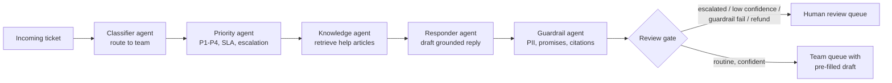

# Support Ticket Triage Agents

[](https://github.com/meghanaganapa/support-ticket-triage-agent/actions/workflows/ci.yml)


A **multi-agent system** that reads incoming customer support tickets, routes each one to the right team, sets its priority and SLA, escalates outages and security incidents, and drafts a reply grounded in the help centre. Every draft passes **guardrails** and lands in a **human-in-the-loop** review queue before anything is sent.

It runs as a CLI, a REST API that a helpdesk webhook can call, and an **MCP server** so Claude Desktop, Claude Code, Cursor or VS Code can use it as tools.

---

## Business problem

A growing SaaS company (here, *CloudLedger*, a fictional invoicing app for small businesses) gets hundreds of tickets a day in one shared inbox. Today a person reads every ticket to decide:

- **Who owns it?** Billing, engineering, account security, hardware logistics or product.
- **How urgent is it?** An outage or a hacked account must be seen in minutes, while a feature idea can wait days.
- **What do we say?** Most answers already exist in the help centre.

Manual triage is slow, inconsistent across shifts, and urgent tickets get buried behind routine ones.

## Solution

Five specialised agents, each with one job, coordinated by an orchestrator:



| Agent | Job | How |
|---|---|---|
| **Classifier** | Pick the owning team | LLM, cross-checked by a TF-IDF (word + char n-gram) + logistic regression model. If they disagree, confidence drops and a human decides. |
| **Priority** | P1–P4, SLA, escalate? | Takes the most urgent of 3 signals: hand-written rules, a learned escalation model, and the LLM. The LLM can **raise** priority but **never lower** a rule-detected P1. |
| **Knowledge** | Find relevant help articles | TF-IDF retrieval with a category boost. Can be swapped for embeddings or Azure AI Search by replacing one method. |
| **Responder** | Draft the reply | LLM constrained to cite retrieved articles, or a grounded template when offline. |
| **Guardrail** | Make the draft safe | Deterministic checks: redacts card numbers, TFNs, phones and emails; blocks unauthorised promises ("guarantee", "we will refund"); blocks citations to articles that weren't retrieved; blocks other customers' names. |

Every decision is recorded in a per-ticket **trace** (agent, timing, outputs), so a support lead can see *why* a ticket was routed and prioritised the way it was.

## Results

Evaluated on two test sets the models never trained on (`python -m triage.evaluate`):

- **Held-out templates (n=106):** synthetic tickets whose *phrasings* were completely held out of training (a group split, not a random split, so the model can't just memorise templates).
- **Hard set (n=30):** hand-written, messy tickets in new wording: slang, mixed issues, indirect descriptions ("spinning wheel then a server error", "sign in from Brazil").

Offline mode (ML + rules, no LLM, zero cost):

| Metric | Held-out templates | Hard set |
|---|---|---|
| Routing accuracy | 58.5% | 83.3% |
| Priority accuracy | 75.5% | 80.0% |
| **Escalation recall** (urgent tickets caught) | **100%** | **33.3%** |
| Escalation precision | 42.9% | 100% |
| Guardrail pass rate | 100% | 100% |
| Latency per ticket | ~6 ms | ~5 ms |

**What these numbers say:**
- Classic ML + rules is fast and free but **brittle on new wording**. On the hard set it caught only 1 in 3 urgent tickets when they were described in unfamiliar ways. Before adding the learned escalation model, it caught **0%**.
- That gap is exactly why the LLM agents exist. The offline system is the safety net and the CI regression gate. The LLM path is for reading nuance.
- The system deliberately trades precision for recall on escalation. A false alarm costs a lead one minute; a missed outage costs a customer.

> **Run the LLM evaluation yourself:** set a key in `.env`, then run `python -m triage.evaluate --backend anthropic`, or use a free local model with `--backend openai` and Ollama. Results are written to `reports/`.

## Quickstart

```bash
git clone https://github.com/meghanaganapa/support-ticket-triage-agent
cd support-ticket-triage-agent
python -m venv .venv && source .venv/bin/activate
pip install -e ".[dev]"

triage "Someone logged into our account from overseas and changed the bank details on our invoices. I think we've been hacked."
```

Output (offline mode):

```
── CLI-1 ─────────────────────────────
Route:    account → Account Support (confidence 0.87)
Priority: P1 · SLA 15 min 🚨 ESCALATE
Signals:  security
KB:       KB-305 (0.449), KB-303 (0.183)
Status:   HUMAN REVIEW - escalation signal: security
Draft reply:
  Hi there,

  Thanks for letting us know - we've flagged this as urgent and a specialist from our
  Account Support team is looking at it now.
  If you see a login you don't recognise, reset your password immediately and enable 2FA.
  Our security team reviews any report of changed bank details or unauthorised access
  within 1 hour and can lock the account to protect it. [KB-305]

  We'll follow up shortly with next steps.
```

### Use an LLM

```bash
cp .env.example .env
# Claude:      TRIAGE_LLM=anthropic  and ANTHROPIC_API_KEY=...
# Local/free:  TRIAGE_LLM=openai     with Ollama running (ollama pull llama3.1)
pip install -e ".[anthropic,openai]"
```

### REST API (for helpdesk webhooks)

```bash
uvicorn triage.api:app --reload
curl -X POST localhost:8000/triage -H 'content-type: application/json' \
     -d '{"id": "T1", "body": "We were charged twice this month"}'
```

Endpoints: `GET /health`, `POST /triage`, `POST /triage/batch`. Interactive docs are at `/docs`. A `Dockerfile` is included.

### MCP server (Claude Desktop, Claude Code, Cursor, VS Code)

Add this to your MCP client config (for example, `claude_desktop_config.json`):

```json
{
  "mcpServers": {
    "support-triage": {
      "command": "/absolute/path/to/.venv/bin/python",
      "args": ["-m", "triage.mcp_server"],
      "cwd": "/absolute/path/to/support-ticket-triage-agent"
    }
  }
}
```

| Tool | What it does |
|---|---|
| `triage_ticket(body, subject?, customer?)` | Full multi-agent pipeline on one ticket |
| `search_help_centre(query, k?)` | Ranked help-centre articles |
| `routing_policy()` | Team per category and SLA per priority |

Then ask your assistant: *"Triage this customer email and tell me who should handle it."*

## Design decisions

Questions an interviewer is likely to ask, and the reasoning behind each choice:

- **Why several agents instead of one big prompt?** Each agent is small, testable and replaceable. The guardrail is pure Python because safety checks must be deterministic. Retrieval can move to a vector database without touching the other agents. One prompt doing everything is hard to test and hard to debug.
- **Why keep an ML model when there's an LLM?** It runs in milliseconds for free. It's the fallback when the LLM is down or returns malformed JSON. And disagreement between the two is a cheap, useful uncertainty signal for routing to humans.
- **Why can the LLM raise priority but never lower it?** Escalation is safety-critical. A model hallucination should never be able to downgrade a detected outage.
- **Why a group split by template?** A random split put near-identical tickets in both train and test, which gave a misleading ~99% accuracy. Holding out whole templates measures generalisation to unseen wording, and it dropped accuracy to 58%. That's the honest number.
- **Why human-in-the-loop?** Drafts are never auto-sent. Escalations, low-confidence routing, guardrail failures and every refund (money leaving the business) go to a person.
- **Why a custom orchestrator instead of LangGraph or CrewAI?** The flow is a fixed pipeline with one decision gate, so a framework would add dependencies without adding capability. Each agent has a `run()` method, so moving to LangGraph nodes later would be mechanical.
- **Why build an MCP server?** It makes the system usable from any MCP-compatible assistant without writing a UI, and it's the emerging standard way to give agents tools.

## Limitations and next steps

- The data is synthetic plus a 30-ticket hand-written set. The next step is evaluating on a public support dataset or anonymised real tickets.
- Run and publish the LLM-mode evaluation (Claude Haiku vs a local Llama), with cost per 1,000 tickets.
- Add embeddings-based retrieval and compare its hit rate against TF-IDF.
- Add a feedback loop that retrains the ML baseline on human corrections from the review queue.
- Connect to a real helpdesk (Zendesk or Freshdesk webhook) and post drafts as internal notes.

## Project structure

```
src/triage/
  agents/          classifier, priority, knowledge, responder, guardrail
  orchestrator.py  pipeline + human-in-the-loop review gate + trace
  llm.py           offline | Anthropic | OpenAI-compatible (Ollama, Azure OpenAI)
  evaluate.py      metrics on held-out and hard sets -> reports/
  api.py           FastAPI service
  mcp_server.py    MCP server (3 tools)
  cli.py           command-line demo
kb/help_centre.md  20 help-centre articles the agents retrieve from
data/              400 synthetic labelled tickets + 30 hand-written hard tickets
scripts/           dataset generator (deterministic, seeded)
tests/             27 tests incl. an evaluation regression gate run in CI
```

## Running tests

```bash
pytest -q          # 27 tests, no API key or network needed
ruff check src tests
```

CI runs lint, tests and the evaluation on every push, and fails if escalation recall on the held-out set drops below 95%.

---

Built by **Meghana Ganapa**. MIT licensed.
