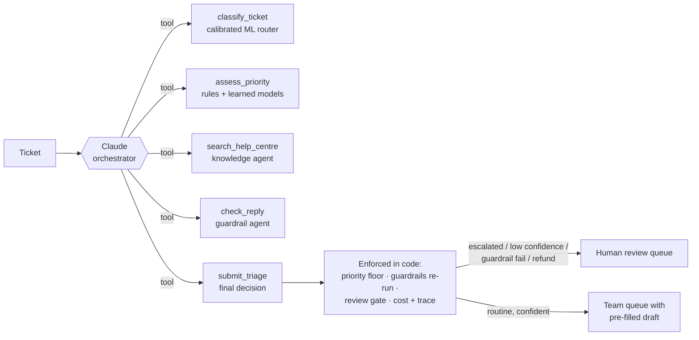

# Support Ticket Triage Agents

[](https://github.com/meghanaganapa/support-ticket-triage-agent/actions/workflows/ci.yml)


A **multi-agent system** that reads incoming customer support tickets, routes each one to the right team, sets its priority and SLA, escalates outages and security incidents, and drafts a reply grounded in the help centre. **Claude, through the Claude Agent SDK, orchestrates the agents as tools**, while safety guarantees are enforced in code. Every draft passes **guardrails** and goes to a **human-in-the-loop** review gate before anything is sent.

It runs as a CLI, a REST API that a helpdesk webhook can call, and an **MCP server**. With no API key, it falls back to a calibrated ML + rules pipeline that costs nothing.

---

## Business problem

A growing SaaS company (here, *CloudLedger*, a fictional invoicing app for small businesses) gets hundreds of tickets a day in one shared inbox. Today a person reads every ticket to decide:

- **Who owns it?** Billing, engineering, account security, hardware logistics or product.
- **How urgent is it?** An outage or a hacked account must be seen within 15 minutes, while a feature idea can wait two days.
- **What do we say?** Most answers already exist in the help centre.

Manual triage is slow, inconsistent across shifts, and urgent tickets get buried behind routine ones.

## Solution

### Claude as orchestrator (Claude Agent SDK)



Claude plans the triage: it reads the ticket, calls the agents as tools through an in-process MCP server, can overrule a low-confidence route, writes the reply, fixes it until the guardrail passes, and submits a structured decision. Claude gets **only these five tools**, with no file, shell or web access, plus a per-ticket **budget cap** and **turn limit**.

Then the code enforces what an LLM must never be trusted with alone:

| Guarantee | How |
|---|---|
| Claude can **raise** priority but never **lower** what the rules detected | `priority = max(rules floor, Claude)` |
| Every reply is re-checked, even if Claude skipped `check_reply` | Deterministic guardrail runs again on the submitted reply |
| Refunds, escalations, low confidence and guardrail failures reach a person | Review gate after Claude's decision |
| The service never goes down with the LLM | Any SDK, network or budget failure falls back to the offline pipeline, and the trace says why |
| Every run is auditable and costed | Per-ticket trace of tool calls, plus turns, tokens and USD from the SDK's `ResultMessage` |

### The agents (also usable without Claude)

| Agent | Job | How |
|---|---|---|
| **Classifier** | Pick the owning team | Word + character n-gram TF-IDF, then **calibrated** logistic regression (Platt scaling), so a 0.8 confidence really means right about 80% of the time |
| **Priority** | P1–P4, SLA, escalate? | The most urgent of: hand-written rules, a learned P1–P4 model, and a learned escalation model. Thresholds are tuned on dev data. |
| **Knowledge** | Find help articles | TF-IDF over articles plus search-only keywords, with a category boost |
| **Responder** | Draft the reply | Claude in agent mode, or a grounded template offline |
| **Guardrail** | Make the draft safe | Redacts card numbers, TFNs, phones and emails; blocks unauthorised promises, hallucinated citations and other customers' names |

## Results

### How it was measured

The goal was results that would survive an interviewer's scepticism:

- **Locked test set (90 hand-written tickets, 14 urgent).** It was [committed](https://github.com/meghanaganapa/support-ticket-triage-agent/commits/main/data/test_locked.jsonl) *before* any v0.2 change, and is checksum-verified on every evaluation and in CI. It is reported, never tuned on.
- **Dev set (30 hand-written tickets).** The only data used to tune thresholds.
- **Held-out templates (106 synthetic tickets).** These are generated from templates that never appear in training, so the model can't pass by memorising phrasings.
- **95% bootstrap confidence intervals** on every metric, and a **paired bootstrap** of v0.1 vs v0.2 on the same tickets. On 90 tickets, one urgent ticket moves recall by 7 points, so a difference only counts as real if its interval excludes zero.

### v0.1 → v0.2 on the locked test set (offline mode, zero cost)

| Metric | v0.1 | v0.2 | Paired difference (95% CI) | Verdict |
|---|---|---|---|---|
| Routing accuracy | 80.0% | **86.7%** | +6.7 pts (+2.2 to +12.2) | ✅ improved |
| Auto-queued (no human needed) | 44.4% | **62.2%** | +17.8 pts (+10.0 to +26.7) | ✅ improved |
| Retrieval hit@2 (right article in top 2) | 78.3% | **88.4%** | +10.1 pts (+2.9 to +18.8) | ✅ improved |
| Priority accuracy | 78.9% | 83.3% | +4.4 pts (−1.1 to +10.0) | within noise |
| Escalation recall (urgent caught) | 78.6% (11/14) | 85.7% (12/14) | +7.1 pts (−14.3 to +35.7) | within noise |
| Escalation precision | 78.6% | 70.6% | — | ⚠️ lower |
| Routing accuracy of auto-queued tickets | 90.0% | 92.9% | — | below the 95% target set on dev |
| Guardrail pass rate | 100% | 100% | — | — |

Reports: [`reports/v0.1/`](reports/v0.1), [`reports/v0.2/`](reports/v0.2), paired comparison: [`reports/v0.2/paired_comparison_test.json`](reports/v0.2/paired_comparison_test.json).

**What changed in v0.2:**
1. **Calibrated confidence** plus a review threshold chosen on dev data against a business rule: "auto-queue as much as possible while keeping auto-queued routing at least 95% correct". This turned a magic number into a defensible decision, and it's the main driver of the +17.8 pt auto-queue gain.
2. **102 varied hand-written training tickets** (synthetic templates alone taught the model phrasings, not meanings). A leakage test in CI checks that none near-duplicate an evaluation ticket; the closest pair is 67% similar.
3. **A learned P1–P4 priority model** alongside the rules (it can raise priority, never lower it).
4. **Search keywords on help articles** plus a tuned category boost, which lifted retrieval hit@2 by 10 points.

**What the numbers say honestly:**
- Three improvements are statistically clear. Priority and escalation moved up, but not beyond noise at this sample size.
- Escalation **precision dropped**. With the F2 objective (recall weighted 2× precision), the tuner judged that worth it; on 14 urgent tickets, both effects are a ticket or two.
- Auto-queued routing landed at 92.9%, short of the 95% target it was tuned to on dev. Dev (30 tickets) is too small to set that threshold precisely; a bigger dev set is the fix.
- **The remaining misses are a wording problem.** For example, *"A staff member we let go last week still seems to be logging in and downloading reports"* is a security incident, but offline mode calls it a technical P3. The review gate still sends it to a human (low confidence), so it doesn't slip through silently. **Reading that kind of ticket is what the Claude orchestrator is for.**

### Claude Agent SDK mode: measure it yourself

The Claude-orchestrated numbers aren't in this README yet, because every published number here comes from a run I can reproduce. Run it with your own key:

```bash
export ANTHROPIC_API_KEY=sk-ant-...
make eval-claude      # 20 locked-test tickets with Claude Haiku 4.5, prints accuracy AND cost per ticket
```

A wiring check showed a single Claude turn costs about $0.003 with Haiku 4.5. A full triage takes about 6–8 tool-calling turns, so expect a few cents per ticket. Every run reports its exact cost, and `max_budget_usd` caps each ticket (default $0.10). Set a monthly spend limit in the Anthropic Console as well.

## Quickstart

```bash
git clone https://github.com/meghanaganapa/support-ticket-triage-agent
cd support-ticket-triage-agent
python -m venv .venv && source .venv/bin/activate
pip install -e ".[dev]"

triage "Someone logged into our account from overseas and changed the bank details on our invoices. I think we've been hacked."
```

Output (offline mode):

```
── CLI-1 ─────────────────────────────
Route:    account → Account Support (confidence 0.95)
Priority: P1 · SLA 15 min 🚨 ESCALATE
Signals:  security
KB:       KB-305 (0.57), KB-302 (0.192)
Status:   HUMAN REVIEW - escalation signal: security
Draft reply:
  Hi there,

  Thanks for letting us know - we've flagged this as urgent and a specialist from our
  Account Support team is looking at it now.
  If you see a login you don't recognise, reset your password immediately and enable 2FA.
  Our security team reviews any report of changed bank details or unauthorised access
  within 1 hour and can lock the account to protect it. [KB-305]

  We'll follow up shortly with next steps.
```

### Switch on Claude

```bash
cp .env.example .env
# TRIAGE_LLM=agent-sdk   and   ANTHROPIC_API_KEY=sk-ant-...
triage "A staff member we let go last week still seems to be logging in and downloading reports"
```

`TRIAGE_LLM` can be `offline` (default, free), `agent-sdk` (Claude orchestrates the agents as tools), `anthropic` (one Claude call per agent in a fixed pipeline), or `openai` (OpenAI, Azure OpenAI or a free local model via Ollama).

### REST API (for helpdesk webhooks)

```bash
uvicorn triage.api:app --reload
curl -X POST localhost:8000/triage -H 'content-type: application/json' \
     -d '{"id": "T1", "body": "We were charged twice this month"}'
```

Endpoints: `GET /health`, `POST /triage`, `POST /triage/batch`. Interactive docs are at `/docs`. A `Dockerfile` is included.

### MCP server (Claude Desktop, Claude Code, Cursor, VS Code)

```json
{
  "mcpServers": {
    "support-triage": {
      "command": "/absolute/path/to/.venv/bin/python",
      "args": ["-m", "triage.mcp_server"],
      "cwd": "/absolute/path/to/support-ticket-triage-agent"
    }
  }
}
```

| Tool | What it does |
|---|---|
| `triage_ticket(body, subject?, customer?)` | Full triage on one ticket (uses whichever backend `TRIAGE_LLM` selects) |
| `search_help_centre(query, k?)` | Ranked help-centre articles |
| `routing_policy()` | Team per category and SLA per priority |

## Design decisions

- **Why Claude as orchestrator instead of a fixed pipeline?** A fixed pipeline can't decide that a ticket the router called "technical" is really a security incident, or search the help centre again with a better query. Claude can plan, re-query and overrule, while the code keeps the guarantees.
- **Why enforce guarantees in code, around the agent?** Prompts are requests, not controls. The priority floor, guardrail re-run and review gate run after Claude's decision, so a hallucination or prompt injection in a ticket can't downgrade an outage or send an unchecked reply.
- **Why only five tools and no built-in tools?** Least privilege. A triage agent has no reason to read files or run shell commands, and a ticket is untrusted input.
- **Why keep the offline pipeline?** It costs nothing, runs in milliseconds, is the fallback when the API is down or over budget, and is what CI tests on every push.
- **Why calibrate the classifier?** Uncalibrated scores made the 0.55 review threshold arbitrary, and v0.1 sent 94% of held-out tickets to humans. Calibrated probabilities let the threshold encode a business rule.
- **Why F2 for escalation thresholds?** Pure recall picked "escalate almost everything" (14% precision on the tuning data). F2 says a missed outage costs about twice a false alarm, without that degenerate answer. It's documented in [`scripts/tune_thresholds.py`](scripts/tune_thresholds.py).
- **Why a locked, checksummed test set and paired bootstrap?** Small hand-written test sets are easy to fool yourself with. Committing the set before the changes, never tuning on it, and testing whether differences exclude zero is what makes "+17.8 points" credible.
- **Why a custom orchestrator for the offline path, not LangGraph?** It's a fixed pipeline with one gate. The agentic version uses the Claude Agent SDK, where planning actually matters.

## Limitations and next steps

- Measure Claude Agent SDK mode on the full locked test set (accuracy, escalation recall, cost per ticket), and compare it with offline mode using the same paired bootstrap.
- Grow the dev set beyond 30 tickets; it's too small to hit the 95% auto-queue routing target precisely.
- The hand-written training, dev and test tickets come from the same AI-assisted author, so they likely share a style and the test may flatter the model. The next step is a public support dataset or anonymised real tickets.
- Add embeddings-based retrieval and a retraining loop from human corrections in the review queue.

## Project structure

```
src/triage/
  agent_sdk.py     Claude Agent SDK orchestrator: agents as tools + guarantees enforced in code
  agents/          classifier, priority, knowledge, responder, guardrail
  orchestrator.py  offline/fixed pipeline + human-in-the-loop review gate + trace
  factory.py       picks the orchestrator from TRIAGE_LLM
  llm.py           offline | Anthropic | OpenAI-compatible (Ollama, Azure OpenAI)
  evaluate.py      metrics with 95% bootstrap CIs, retrieval hit@2, cost per ticket
  api.py · mcp_server.py · cli.py
config/thresholds.json   thresholds chosen on dev + held-out (never test)
data/              400 synthetic + 102 varied training tickets · 30 dev · 90 locked test (+ checksum)
kb/help_centre.md  20 help-centre articles with search keywords
scripts/           dataset generator · threshold tuner · paired version comparison
reports/v0.1, v0.2 evaluation reports
tests/             38 tests: agents, guardrails, Agent SDK orchestrator (scripted fake Claude), API, MCP, data leakage, regression gate
```

## Running tests

```bash
pytest -q          # 38 tests, no API key, no network, no cost
ruff check src tests
make tune          # re-pick thresholds on dev + held-out
make eval          # held-out + dev
make eval-test     # locked test set (report only)
```

CI runs lint, the tests and the full evaluation on every push. It fails if the locked test set's checksum changes, if a training ticket near-duplicates an evaluation ticket, or if held-out escalation recall, routing or priority accuracy fall below their gates.

---

Built by **Meghana Ganapa**. MIT licensed.
